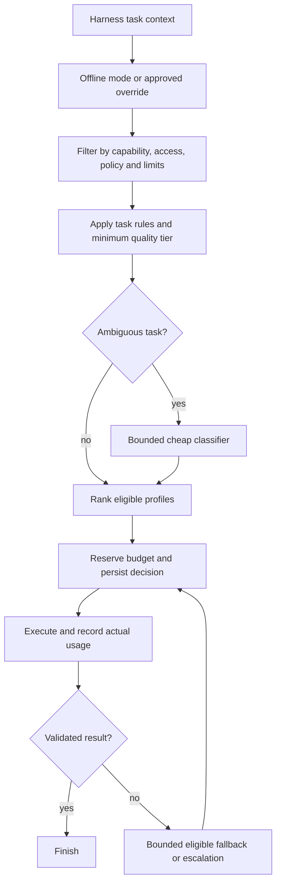

# Separate model router package: design proposal

Date: 4 October 2026. Status: initial implementation complete. The research and
longer-term proposal below are retained; current behavior is described in
[the implementation report](MODEL_ROUTER_IMPLEMENTATION.md).

Build `harness-model-router`, an independently installable Python package at
`packages/model-router/`, with a provider-neutral routing core and an optional
LangChain adapter. Keel supplies its task profiles, model registry, quality checks,
credentials, budget store and telemetry sink. Start with GPT-6 Luna for routine work,
evaluate Qwen, Fireworks DeepSeek V4.1 Flash and GLM 5.3 Flash as alternatives,
and escalate only when task evidence requires it.

I interpret “qwan” as Qwen. The package supports hosted and self-hosted Qwen endpoints;
the exact deployment is configuration, not a hard-coded dependency.

## Research findings

[The LangChain post](https://www.langchain.com/blog/how-to-build-a-model-router-in-the-harness)
describes a harness-level classifier, task-specific tier criteria, a persisted
thread route, and outcome monitoring. Across 973 experimental threads, median cost
fell 64% and mean cost fell 42%. Merged-PR rates were 29.2% versus 27.3%
with p=0.49. A fast-only experiment was stopped early after quality complaints.
These observations motivate routing; they do not establish quality equivalence or
predict savings for Keel. Its current baseline already uses inexpensive models.

The post leaves mid-thread and subagent routing as future work. Its linked
[Open SWE implementation](https://github.com/langchain-ai/open-swe/blob/main/agent/middleware/model_selection.py)
persists a route and swaps models via middleware. The linked
[TypeSafe router](https://docs.langchain.com/oss/python/integrations/providers/typesafe)
instead classifies the latest human message per run and is experimental.

Our adaptation needs two routing scopes: a conversational task episode and a
document extraction stage. Distinguish model availability failures from quality
failures, and evaluate the complete retry chain. This is a design recommendation.

## What the repository actually does

| Location | Finding | Design consequence |
|---|---|---|
| `backend/keel/agents/factory.py` | Deep Agents uses one `chat_model()`; offline mode exists; calls and tools have run limits | Add middleware without changing tenant tools, permissions or offline behavior |
| `backend/keel/platform/config.py` | Ask defaults to Luna; parser currently defaults to Gemini 3.8 Flash | Compare against these actual baselines; README's Luna-parser description is stale |
| `backend/keel/documents/pipeline.py` | Blocking findings or low reported confidence trigger Gemini, then an optional tier-4 engine | Preserve validators and review; make distinct escalation strategies explicit |
| `backend/keel/documents/engines/llm.py` | Sends images plus OCR and requires structured output | Text-only Qwen cannot replace this engine directly |
| `backend/keel/agents/routes.py` | Aggregates tokens and prices them as `model_default` | Replace with per-call attribution before enabling mixed-model traffic |
| `backend/keel/documents/engines/base.py` | Unknown model price silently becomes zero | Represent unknown prices explicitly; exclude from automatic cost optimization |
| `backend/keel/platform/config.py` | `model_reasoning`, `model_fallback` and monthly budget are configured but not consumed by routing | Wire them deliberately; configuration alone provides no fallback or budget enforcement |
| `backend/keel/evals/parsers.py` | Existing gold evaluation checks accuracy and invented values | Extend it to score routed chains, not just single engines |

With today's defaults, a Gemini first pass can be followed by another Gemini read.
That might be a useful second look, but it is not a model upgrade. Record it as a
different attempt strategy, only retain it if evals justify it, and never enter a loop.

Installed `deepagents` 0.7.21 accepts middleware, and installed LangChain exposes
`request.override(model=...)`. Its general-purpose subagent does not automatically
inherit arbitrary parent middleware. Route and meter that path explicitly.

## Model profiles

“Best” means the lowest expected total cost among eligible profiles that meet a
task-specific quality floor and latency target. A profile is model + endpoint +
reasoning settings + capability contract; a model name alone is insufficient.

| Profile | Initial candidate | Intended work | Activation |
|---|---|---|---|
| Fast | `openai:gpt-6-luna`, low effort for agent work | Known-tool lookups, concise summaries, bounded classification | Initial default, subject to task evals |
| Fast alternative | Hosted `qwen3.8-flash` or a pinned self-hosted Qwen instruct deployment | Text classification, formatting and bounded read-only tool tasks | Disabled until endpoint contract tests and task evals pass |
| Fireworks fast/agentic candidate | `fireworks:accounts/fireworks/models/deepseek-v4p1-flash` | Read-only tool workflows, record synthesis; separate vision extraction bake-off | Task-specific placement after contract tests and quality/cost evals |
| Fireworks fast/vision candidate | `fireworks:accounts/fireworks/models/glm-5p3-flash` | Lookups, summaries, bounded classification; separate vision extraction bake-off | Task-specific placement after contract tests and quality/cost evals |
| Balanced | `openai:gpt-6-sol`, medium effort | Multi-step synthesis across records, ambiguous tool plans | Opt-in for approved task families |
| Performance | `openai:gpt-6-astra`, low effort | Difficult reasoning remaining after balanced; explicitly demanding tasks | Disabled by default until a measured benefit justifies it |
| Vision | Existing Gemini handwriting model; Luna as evaluated alternative | Page transcription with evidence and structured schema | Preserve current document baseline initially |
| Specialist | Existing Reducto, ADE or Sol extraction engine | Documents still failing validated reads | Keep existing opt-in configuration |
| Offline | Existing offline agent and deterministic extractor | Tests, demos and explicitly offline operation | No classifier or network call |

OpenAI documents Luna for focused, high-volume work and supports images, structured
outputs and function calling. Sol supports complex agentic work. Astra accepts
reasoning efforts starting at `low`, so the current extractor's universal OpenAI
`none` setting must not be applied to it. Use profile-specific parameters and the
Responses API for OpenAI tool calls. See official model pages:
[Luna](https://developers.openai.com/api/docs/models/gpt-6-luna),
[Sol](https://developers.openai.com/api/docs/models/gpt-6-sol),
[Astra](https://developers.openai.com/api/docs/models/gpt-6-astra).

QwenCloud lists `qwen3.8-flash` as a lightweight candidate with function calling
and structured output. Those are provider claims, not Keel quality results.
Structured-output behavior depends on model and thinking mode; JSON mode is not
proof of schema compliance. Validate the precise deployment and settings.
Sources: [model catalog](https://docs.qwencloud.com/developer-guides/getting-started/text-generation-models),
[structured output](https://docs.qwencloud.com/developer-guides/text-generation/structured-output),
[Qwen tool calling](https://qwen.readthedocs.io/en/stable/framework/function_call.html).

Qwen is not assumed cheaper than Luna. Compare hosted token prices or amortized
GPU cost, utilization, operations, latency and retry rates. A text endpoint is
eligible only for text tasks; enabling a vision profile requires a separate test.
Credentials and account access have not been tested in this design review.

### Fireworks candidates added on 4 October 2026

Preserve the exact provider model paths requested:
`accounts/fireworks/models/deepseek-v4p1-flash` and
`accounts/fireworks/models/glm-5p3-flash`. The `fireworks:` prefix above is Keel's
provider selector, not part of the model ID sent to Fireworks. GLM 5.3 Flash is
distinct from the configured non-Flash `accounts/fireworks/models/glm-5p3`.

Fireworks lists both requested models as serverless-ready, with image input,
function calling and a served 1040k-token context. Treat these as declared
capabilities requiring endpoint verification, not evidence of Keel task quality.
Sources: [DeepSeek V4.1 Flash](https://fireworks.ai/models/deepseek-ai/deepseek-v4p1-flash),
[GLM 5.3 Flash](https://fireworks.ai/models/fireworks/glm-5p3-flash).

| Exact model suffix | Standard input | Cached input | Output |
|---|---:|---:|---:|
| `deepseek-v4p1-flash` | $0.30 | $0.006 | $1.20 |
| `glm-5p3-flash` | $0.15 | $0.03 | $0.50 |

USD per million tokens, checked 4 October 2026 against
[Fireworks serverless pricing](https://docs.fireworks.ai/serverless/pricing).
DeepSeek's model-page FAQ still quotes different rates; use the dedicated pricing
table and matching headline rates for this proposal, and verify account rates
before rollout. Priority and regional deployment rates require separate profiles.

Evaluate each against Luna on identical tasks and effort/output budgets. Allow
fast or balanced eligibility by task family: “Flash” is not a measured quality tier.
DeepSeek's lower cached-input rate may favor cached, long-input workloads; GLM
is a plausible economical peer. Measure cache hits and complete-job spend before
assigning either preference. An outage fallback between these two still depends
on Fireworks; retain an eligible cross-provider fallback for provider outages.

Add an optional `langchain-fireworks` integration, reusing Keel's existing dependency
and `FIREWORKS_API_KEY` injection. Test streaming usage/cache fields, tool results,
reasoning settings, schema parsing and image inputs for each exact model. Fireworks
documents JSON-schema output and notes that this mode disables reasoning output;
test the chosen extraction mode separately from agent tool calls. See
[structured outputs](https://docs.fireworks.ai/structured-responses/structured-response-formatting).
Neither profile inherits OpenAI Responses/effort parameters. Consider them as
classifier candidates only if classification accuracy and overhead beat Luna.

## Package boundary

```text
packages/model-router/
  pyproject.toml                 # own distribution, version and build
  README.md
  src/harness_model_router/
    contracts.py                # requests, profiles, decisions, attempts
    registry.py                 # capability and configuration validation
    policy.py                   # eligibility and selection
    classifier.py               # replaceable bounded classifier protocol
    escalation.py               # attempt transitions and limits
    pricing.py                  # versioned Decimal cost estimates
    events.py                   # observer protocol
    adapters/langchain.py       # middleware and model factory adapter
  tests/
    unit/
    contract/
    integration/
```

Use Python >=3.13 initially, matching Keel. Core depends only on Pydantic and the
standard library; `langchain` and provider integrations are extras. No dependency
on FastAPI, SQLAlchemy, Keel, Langfuse, LangSmith or a remote routing service.
Build a wheel and test it in an isolated environment without Keel installed.

Keel integration lives in `backend/keel/routing/`. Task rules, domain validators,
tenant budget persistence and model IDs stay there or in `platform/config.py`.
Wire a uv path dependency through `backend/pyproject.toml`; preserve the option
to move the package to its own repository later. No package publication is needed.

## Contracts

| Contract | Essential fields |
|---|---|
| `RouteRequest` | task family, trusted task summary, required modalities/tools/schema, estimated input/output, risk floor, previous route, validation signals, deadline, budget context |
| `ModelProfile` | stable profile ID, provider/model/deployment, capabilities, context/output limits, supported effort/settings, approved task families, quality evidence version, price version |
| `RouteDecision` | selected profile, eligible alternatives, reason codes, policy/registry versions, task episode, estimated cost, classifier provenance, fallback/escalation plan |
| `AttemptOutcome` | actual profile/provider model, unique attempt ID, usage, latency, normalized error, validation result, cost status |
| `BudgetStore` | atomically reserve estimated spend, reconcile actual spend, release unused reservation; supplied by host |
| `EventSink` | record decisions, attempts, transitions and completion; supplied by host |

Proposed APIs: `await router.select(request) -> RouteDecision` and
`await router.next_attempt(decision, outcome) -> RouteDecision | StopDecision`.
Selection itself does not run business tools. Host adapters execute calls and
report outcomes. `ModelFactory` constructs models using injected credentials.

Only trusted configuration can register models or endpoints. Classifiers choose
an enum task category or approved tier; they cannot invent IDs, base URLs, settings,
budgets, permissions or tools. Validate decisions against the registry every time.

## Selection policy



1. Offline/fake mode short-circuits routing. An explicit model override must still
   satisfy capabilities, provider policy and budget; it cannot bypass a quality floor.
2. Filter unsupported modalities, tools and schema modes; missing credentials;
   disallowed endpoints; context/output overflow; disabled or unhealthy deployments.
   Include system prompts, skills, tools and expected output in context estimates.
3. Apply Keel task rules. A single approved-tool lookup starts fast. Synthesis across
   several records starts balanced when evals support it. An image job starts in
   the vision lane. Safety-sensitive ambiguity raises the floor but never authorizes
   a business action. Text length alone is not a complexity classifier.
4. If rules are insufficient, use a small structured classifier over a bounded,
   server-assembled summary. Initially use Luna; evaluate Qwen and the two
   Fireworks Flash profiles as replacements.
   No extra classifier for clear fast tasks. Timeout/malformed output selects the
   configured conservative eligible default, never an arbitrary flagship.
5. Rank candidates that have passed the relevant task quality gate by estimated
   complete-task cost, then measured latency. Include classifier cost, expected
   retries and cache loss. Initially use explicit ranks where data is insufficient;
   label estimates rather than inventing success probabilities.
6. Reserve budget atomically before each paid attempt. If no candidate qualifies,
   return a typed stop reason: unavailable, insufficient capability, budget or deadline.

Any classifier confidence is a diagnostic. A generative model's self-reported
confidence is not a calibrated probability of successful task completion. Quality
eligibility comes from held-out task outcomes, not confidence alone.

## Route persistence and escalation

For Ask Keel, choose once per task episode and persist profile, policy version,
episode ID and escalation count in the existing server-scoped checkpointer.
Continue on that profile for related follow-ups. At a new user turn, check for
material task change, newly required capability or prior failure. Do not classify
each token or tool call, or permanently pin an entire conversation to its first task.

Revalidate persisted routes for revoked access, budget and context fit. Keep
ordinary routing state per run/thread; never mutate a shared “default model”
object to reflect one user's override. Serialize conflicting turns on one thread
or use checkpoint concurrency controls.

For extraction, select per document stage. Preserve source pages, schema, field
statuses, validators, evidence alignment and human review. Text-only extraction
is a later optimization restricted to evaluated documents with reliable text layers.
Do not silently strip images to fit a cheaper model.

| Outcome | Transition |
|---|---|
| Transport timeout / 429 / temporary overload | Bounded backoff or eligible peer; no automatic intelligence upgrade |
| Authentication or unsupported parameter | Mark deployment unavailable/misconfigured; eligible peer or stop |
| Invalid schema / invalid tool arguments | At most one repair, then eligible stronger profile or specialist |
| Domain validator failure / repeated ineffective tool plan | Escalate with compact failure evidence and preserved source context |
| Missing source data / empty retrieval | Ask for missing evidence or return unresolved; stronger models cannot manufacture facts |
| Budget/deadline exhausted | Stop automation, retain reviewable evidence and mark incomplete |

Initial proposed limits: one classifier call, one transport retry per attempt,
and at most two profile upgrades per episode. Count all attempts against the
deadline, budget and existing model-call limits; control provider SDK retries
to avoid multiplying retries across layers. Failed calls may incur cost.

Do not retry after visible output has started without an explicit stream boundary;
never concatenate competing answers. Escalate at a safe model-call or user-turn
boundary, after all tool-call IDs have matching results. For document candidates,
reuse the existing validation-based acceptance contract and test disagreements
on critical fields; fewer blocking findings alone does not prove truth.

No automatic downgrade within an episode in v1. Later, evaluate model-local
effort changes and cache-aware switching. Missing data remains missing regardless
of the selected model. Existing approval gates remain the authority for writes.

## Keel integration work

| Area | Required change |
|---|---|
| `agents/factory.py` | Inject router middleware, host task context and profile factory; preserve offline model and read-only tools |
| Deep Agents child calls | Explicitly install routing/usage collection for any enabled child agent; cover summarization calls too; otherwise disable that uncovered path during rollout |
| `agents/routes.py` | Attribute each attempt to its actual profile/model; remove end-of-stream default-model pricing; preserve SSE contract |
| `documents/pipeline.py` | Ask the router for the next eligible extraction strategy; preserve current behavior when routing is off |
| `documents/engines/llm.py` | Receive profile-specific provider kwargs; handle structured parse failures as outcomes |
| `platform/config.py` | Define registry, policy version, enable/shadow flags, Qwen endpoint/key, exact Fireworks Flash IDs, classifier and attempt limits |
| `audit/service.py` / `UsageEvent.ref` | Persist decision and attempt metadata through tenant sessions; reuse existing RLS-protected tables initially |
| `evals/parsers.py` | Add routed-chain evaluation and baseline comparison; do not change gold expectations |

Keel's live-mode detection currently checks only OpenAI/Google credentials.
Support explicit fake mode and determine live availability from configured
profiles so Qwen-only or Fireworks-only deployments work intentionally.
An unknown Qwen provider label must not be passed blindly to `init_chat_model`:
use an explicit compatible-client adapter with verified endpoint behavior.

LangChain's documented middleware supports model overrides via
`request.override(model=...)`. Use async node hooks to persist decisions and
`awrap_model_call` to execute the chosen profile. Verify actual installed
middleware order, tool binding, streaming and state updates in integration tests.
See [custom middleware](https://docs.langchain.com/oss/python/langchain/middleware/custom).

## Accounting, budget and observability

Log profile/model, decision reason, task family, policy version, attempt and parent
IDs, outcome, latency, cached/uncached input, output and actual/estimated USD.
Use `Decimal`. Unknown prices are `unknown`, never free; operator-provided rates
must be marked estimates. Track model calls even when routing is disabled.

Prices are versioned configuration, including applicable processing tier,
regional and long-context multipliers. Reasoning-token accounting follows the
provider's usage semantics without double counting output tokens. Multi-page
attempts count tokens for every call but count the business document once in
completed-job reports. Report cost per successful job as well as per attempt.

Classifier, retries, subagents, summaries, extraction re-reads and failed paid
calls all contribute to spend. Record usage incrementally and deduplicate by
attempt ID, including cancelled streams. Unknown incurred usage is flagged for
reconciliation, not silently discarded.

Keel supplies a Postgres budget implementation shared by API and worker processes.
Use a tenant-scoped atomic reservation/ledger with expiry and reconciliation,
not an in-memory counter. Allow conservative estimates and bounded in-flight
overspend; reconcile provider bills where usage is incomplete. Reuse existing
events for telemetry, and add an RLS migration if reservation storage needs a new table.

Emit to existing optional Langfuse through an adapter; no LangSmith or TypeSafe
requirement. Routine routing logs omit document text, names, emails and secrets.
Detailed trace retention follows the host's existing tracing policy. No cross-tenant
semantic decision cache; any future cache is scoped by tenant, capabilities,
task context, policy and model version.

## Evaluation and rollout

Create a stratified held-out set from authorized, sanitized real tasks and existing
synthetic gold fixtures. Separate calibration and test data; keep all turns or pages
from one task in the same split. Include follow-ups, injection attempts, ambiguous
handwriting, blank fields, tool failures and provider outages. Synthetic data alone
is insufficient to activate Qwen or either Fireworks Flash profile for production tasks.

| Workload | Success measures |
|---|---|
| Ask Keel lookup | Correct tool/arguments, grounded answer, expected record IDs, tenant isolation |
| Ask Keel synthesis | Rubric-reviewed correctness, citations, completion, explicit uncertainty |
| Extraction | Field accuracy, invented values, blank/unreadable distinctions, critical-field recall, evidence quality |
| Router reliability | Capability violations, unavailable-model handling, restart persistence, bounded retries |
| Economics | Total cost per successful job; p50/p95 latency; classifier overhead; escalation rate |

Compare current fixed-model/pipeline behavior, Luna-only where applicable,
Qwen and both Fireworks Flash models on eligible tasks, and the complete routed policy.
Include a separate vision bake-off for both Fireworks candidates. Per-model evals establish
candidate eligibility; full-chain evals establish whether routing is worthwhile.
Use task-stratified paired comparisons and uncertainty intervals. Do not use
“checks passed” or a high model confidence as the only quality measure.

Proposed release gates, to calibrate after baseline measurement: zero observed
tenant/approval violations and invented critical values; no critical-field regression;
general completion non-inferiority margin of 2 percentage points with adequate
sample size; at least 15% lower cost per successful eligible job; p95 latency
within 10% of baseline. These are targets, not established results or guarantees.
Small samples cannot prove non-inferiority: stay in shadow mode when evidence is weak.

1. **Package and accounting:** ship contracts, registry, deterministic policy, fake
   providers, price validation, observer and budget protocols; fix actual-model metering.
2. **Ask Keel shadow:** compute/log routes while executing the current baseline.
   Shadow decisions alone do not measure alternative-model quality; run those offline.
3. **Controlled Ask Keel routing:** activate evaluated Luna/Sol task profiles for
   a small stable cohort; add Qwen and Fireworks Flash profiles only for approved
   families after their bake-offs.
   Assign experimental arms by task episode and analyze tenant/task clustering.
4. **Extraction:** evaluate routed stages against the current Gemini chain and
   gold data before activation; preserve review and specialist opt-in behavior.
5. **Later optimization:** richer classifiers, child-task selection and cache-aware
   effort/routing changes only when traces demonstrate value.

Feature flags: off / shadow / enabled, with separate Ask and extraction switches.
Rollback restores the existing configured baseline; still log actual usage.
Automatic rollback triggers include critical-field invention, a policy violation,
or sustained error/latency regression. Do not roll out without priced eligible profiles.

## Implementation verification

Package tests cover hard filters, overrides, unknown prices, timeout fallback,
quality floors, context limits, repair/escalation bounds and configuration validation.
Contract tests cover each provider's tools, streaming, schema parsing and usage.
Keel integration tests cover tenant/thread separation, restart, concurrent budget
reservation, SSE cancellation, child calls, fake mode and document review/approval.
Run existing RLS, injection, agent and extraction tests plus lint/type checks.
Build/install the wheel independently. Live evals require configured endpoints and
consume a bounded evaluation budget; no live calls were made for this proposal.

The first implementation milestone should deliver the independent package,
accurate metering and Ask Keel shadow integration. Activate routing only after
the measured task results support the proposed model assignments.
